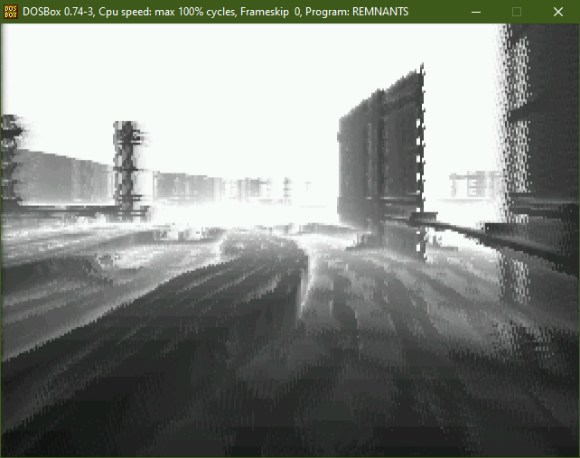

# GLSL-DOS

Compile simple GLSL Shadertoys into small .COM MS-DOS executables using GCC and binutils.

# Usage

In a command line, type `build <shader>` to compile `<shader>.glsl` into `<shader>.com`. For example: `build remnants`

Before compiling, you need to modify your shaders:
- `out` parameters need to be wrapped in a `OUT` macro. For example `out vec4 fragColor` becomes `OUT(vec4, fragColor)`.
- All functions in your shader must explicitely be declared `inline`.
- Never assign to a swizzled vector, it does nothing. For example, don't do `a.xy = vec2(b, c)`, do `a = vec3(b, c, a.z)` instead.
- `exp`, `pow`, textures, multiple buffers (and many other things) are not implemented.
- Color is not implemented, only the red channel is displayed in grayscale.
- A lot of swizzle combinations are missing (WIP), either you add your combination inside glm.h, either you add parenthesis to your swizzle (`a.xy()`).
- Even if you follow all the rules, build success is not guaranteed.